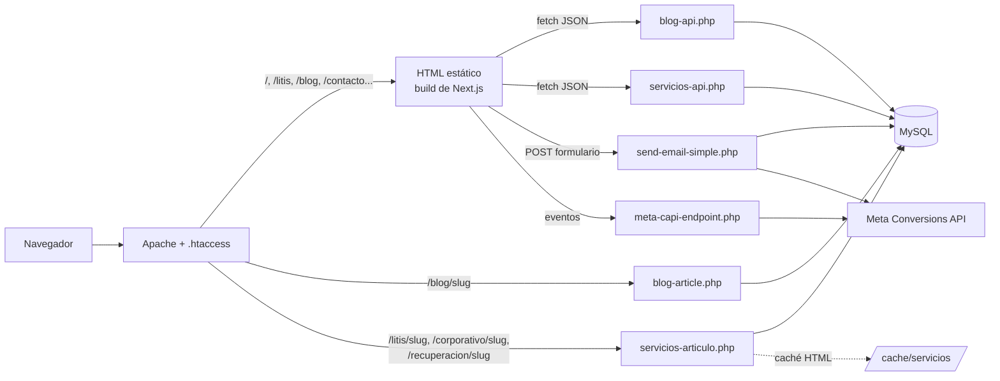

# Manual Técnico y de Usuario — Plataforma Web LITESCO

| Campo | Valor |
|---|---|
| Sistema | Sitio web corporativo `https://litesco.com.co` (sitio público, blog jurídico y CMS de servicios) |
| Versión del documento | 1.0 |
| Fecha | 2026-09-25 |
| Versión de la aplicación | `litesco-web` 2.0.0 (ver `package.json`) |
| Público | **Parte I:** desarrolladores y personal técnico que mantienen la plataforma. **Parte II:** administradores de contenido de LITESCO. |

> **Confidencialidad.** Este documento **no contiene credenciales** y nunca debe contenerlas. Las contraseñas y los tokens viven únicamente en el archivo `.env` del servidor (ver [§5](#5-configuración-y-variables-de-entorno)).

## Contenido

**Parte I — Manual técnico**

1. [Arquitectura general](#1-arquitectura-general)
2. [Stack tecnológico y requisitos](#2-stack-tecnológico-y-requisitos)
3. [Estructura del repositorio](#3-estructura-del-repositorio)
4. [Enrutamiento (Apache `.htaccess`)](#4-enrutamiento-apache-htaccess)
5. [Configuración y variables de entorno](#5-configuración-y-variables-de-entorno)
6. [Modelo de datos (MySQL)](#6-modelo-de-datos-mysql)
7. [Referencia de APIs y endpoints PHP](#7-referencia-de-apis-y-endpoints-php)
8. [Estrategia de caché](#8-estrategia-de-caché)
9. [Seguridad](#9-seguridad)
10. [Entorno de desarrollo y compilación](#10-entorno-de-desarrollo-y-compilación)
11. [Procedimiento de despliegue](#11-procedimiento-de-despliegue)
12. [Mantenimiento operativo](#12-mantenimiento-operativo)
13. [Guía de escalabilidad](#13-guía-de-escalabilidad)
14. [Deuda técnica conocida](#14-deuda-técnica-conocida)

**Parte II — Manual de usuario**

15. [Acceso a los paneles administrativos](#15-acceso-a-los-paneles-administrativos)
16. [Gestión del blog](#16-gestión-del-blog)
17. [Gestión de servicios legales (CMS)](#17-gestión-de-servicios-legales-cms)
18. [Gestión de contactos](#18-gestión-de-contactos)
19. [Buenas prácticas de contenido y SEO](#19-buenas-prácticas-de-contenido-y-seo)
20. [Preguntas frecuentes y solución de problemas](#20-preguntas-frecuentes-y-solución-de-problemas)

---

# PARTE I — MANUAL TÉCNICO

## 1. Arquitectura general

La plataforma es **híbrida**: la mayor parte del sitio es HTML estático generado con Next.js, y el contenido dinámico (artículos, servicios, formularios) lo atienden scripts PHP sobre MySQL, en un hosting compartido cPanel con Apache.



**Principios de diseño**

- **Sin servidor Node en producción.** `next build` exporta HTML/JS/CSS estático (`output: 'export'`) que Apache sirve directamente.
- **Páginas de detalle renderizadas en PHP.** Artículos del blog y páginas de servicio se generan en el servidor para que Google reciba HTML completo, con metadatos y JSON-LD.
- **El contenido se cambia sin tocar código.** Agregar, editar o despublicar artículos y servicios se hace desde los paneles administrativos, no con un nuevo despliegue.
- **Degradación segura.** Si la base de datos no responde, los sitemaps devuelven un XML vacío válido y las APIs responden JSON de error; nunca un cuerpo vacío.

## 2. Stack tecnológico y requisitos

| Capa | Tecnología | Versión / requisito |
|---|---|---|
| Frontend | Next.js (App Router), React | Next 14.2, React 18.3 |
| Estilos | Tailwind CSS, PostCSS, estilos en línea | Tailwind 3.4 |
| UI | framer-motion, lucide-react, react-icons | ver `package.json` |
| Backend | PHP con PDO MySQL | **PHP ≥ 7.4** (usa funciones flecha `fn`) |
| Base de datos | MySQL / MariaDB | Con soporte de columnas `JSON` (MySQL ≥ 5.7.8 / MariaDB ≥ 10.2.7) |
| Servidor web | Apache | Módulos `mod_rewrite` (obligatorio), `mod_headers`, `mod_expires`, `mod_deflate`, `mod_setenvif` |
| Build | Node.js + npm | Node ≥ 18.17 (requisito de Next 14) |
| Imágenes | ImageKit (`ik.imagekit.io`) | URLs externas, transformaciones por parámetro `tr` |
| Analítica | Meta Pixel + Conversions API | Sujeto a consentimiento de cookies |

## 3. Estructura del repositorio

| Ruta | Propósito |
|---|---|
| `app/` | Rutas de Next.js. Cada carpeta es una URL (`app/litis/page.js` → `/litis`). Incluye `sitemap.js` y `robots.js`. |
| `app/*/[slug]/page.js` | **Placeholders.** Solo generan `_placeholder`; en producción el `.htaccess` envía los slugs reales a PHP. |
| `views/` | Componentes de página completos (`HomePage.jsx`, `BlogPage.jsx`, `ServiciosCMSPage.jsx`, etc.). |
| `components/layout/` | `Navbar`, `Footer`, `SiteChrome` (estructura común). |
| `components/ui/` | Componentes reutilizables: consentimiento de cookies, Meta Pixel, botón de WhatsApp, tarjetas de servicio. |
| `components/seo/` | `JsonLd.jsx` — datos estructurados schema.org. |
| `lib/serviciosClient.js` | Cliente que carga los servicios publicados para las páginas de línea de negocio. |
| `lib/login-throttle.php` | Límite de intentos de login por IP. |
| `lib/meta-capi.php` | Envío de eventos a Meta Conversions API. |
| `blog-api.php` | API JSON del blog y de contactos (lectura pública + CRUD autenticado). |
| `blog-article.php` | Renderizador HTML de un artículo (`/blog/{slug}`). |
| `servicios-api.php` | API JSON del CMS de servicios. |
| `servicios-articulo.php` | Renderizador HTML de una página de servicio (`/{linea}/{slug}`). |
| `send-email-simple.php` | Procesa los formularios de contacto. |
| `meta-capi-endpoint.php` | Recibe eventos del navegador y los reenvía a Meta. |
| `blog-sitemap.php`, `servicios-sitemap.php` | Sitemaps dinámicos. |
| `db-config.php` | Configuración de conexión MySQL (lee `.env`). |
| `env.php` | Cargador mínimo de `.env` sin dependencias. |
| `.env.example` | Plantilla de variables de entorno (sin valores reales). |
| `.htaccess` | Redirecciones, enrutamiento, bloqueo de archivos sensibles y caché. |
| `cache/` | Caché en tiempo de ejecución (bloqueado por `cache/.htaccess`). |
| `public/` | Recursos estáticos (imágenes, videos, favicon). |
| `docs/` | Documentación del proyecto (este manual). |

## 4. Enrutamiento (Apache `.htaccess`)

Las reglas se evalúan en este orden:

| # | Regla | Resultado |
|---|---|---|
| 1 | `http://…` | Redirección 301 a `https://` |
| 2 | `www.litesco.com.co` | Redirección 301 al dominio canónico `litesco.com.co` |
| 3 | `/blog`, `/litis`, `/corporativo`, `/recuperacion`, `/faq`, `/contacto`, `/sobre-nosotros`, `/cms-servicios` | Sirve el `.html` estático correspondiente |
| 4 | `/blog/{slug}` | `blog-article.php?slug={slug}` |
| 5 | `/litis/{slug}` · `/corporativo/{slug}` · `/recuperacion/{slug}` | `servicios-articulo.php?linea={linea}&slug={slug}` |
| 6 | Archivos `.env .log .sql .bak .sh .htpasswd .zip .tar .gz .md` | Acceso denegado (403) |

> **Importante:** `trailingSlash: false` en `next.config.js` es intencional. Con `true`, Next.js crea carpetas por slug que interfieren con las reglas 4 y 5.

**Página nueva:** toda página estática nueva (§13.2) necesita su regla en el bloque 3.

## 5. Configuración y variables de entorno

Todas las credenciales y los identificadores se leen del archivo `.env` en la raíz del sitio. `env.php` lo carga, y `db-config.php` lo incluye automáticamente.

- `.env` está en `.gitignore` y **nunca se versiona**.
- `.htaccess` bloquea su descarga por web.
- Plantilla: `.env.example`.

| Variable | Obligatoria | Uso |
|---|---|---|
| `DB_HOST` | No (por defecto `localhost`) | Servidor MySQL |
| `DB_NAME` | **Sí** | Nombre de la base de datos |
| `DB_USER` | **Sí** | Usuario MySQL |
| `DB_PASS` | **Sí** | Contraseña MySQL |
| `DB_CHARSET` | No (por defecto `utf8mb4`) | Juego de caracteres |
| `ADMIN_EMAIL` | Sí | Correo del administrador del CMS de servicios |
| `ADMIN_HASH` | **Sí** | Hash bcrypt de la contraseña del CMS de servicios. Sin él, el login queda deshabilitado. |
| `META_PIXEL_ID` | No | ID del Pixel leído por PHP |
| `NEXT_PUBLIC_META_PIXEL_ID` | No | Mismo ID, inyectado al frontend **en tiempo de build** |
| `META_CAPI_ACCESS_TOKEN` | No | Token de Meta Conversions API |
| `META_CAPI_TEST_EVENT_CODE` | No | Solo para pruebas en el panel "Probar eventos" de Meta. Quitar en producción. |

**Generar `ADMIN_HASH`:**

```bash
php -r "echo password_hash('NuevaContraseñaSegura', PASSWORD_DEFAULT);"
```

> Si falta `DB_NAME`, `DB_USER` o `DB_PASS`, `db-config.php` escribe una advertencia en el log de errores de PHP y todas las páginas que usan la base de datos fallan de forma controlada.

## 6. Modelo de datos (MySQL)

Todas las tablas viven en la misma base de datos, con juego de caracteres `utf8mb4`.

### 6.1 Tablas del CMS de servicios (autogestionadas)

`servicios-api.php` crea y migra estas tablas automáticamente (`ensureTables()`). El proceso corre como máximo una vez cada 24 h, controlado por el archivo bandera `cache/.servicios-schema-ok`.

**`servicios`**

| Columna | Tipo | Notas |
|---|---|---|
| `id` | INT PK AI | |
| `linea_negocio` | ENUM(`litis`,`corporativo`,`recuperacion`) | Define la URL `/{linea}/{slug}` |
| `subcategoria` | VARCHAR(100) | Agrupa el servicio en las pestañas de la página de la línea |
| `slug` | VARCHAR(200) **UNIQUE** | |
| `seo_title` | VARCHAR(60) | Se trunca a 60 caracteres |
| `meta_desc` | VARCHAR(160) | Se trunca a 160 caracteres |
| `resumen_rapido` | TEXT | Bloque de respuesta rápida |
| `h1` | VARCHAR(250) | Obligatorio |
| `content` | LONGTEXT | HTML del cuerpo |
| `faqs` | JSON | Arreglo de `{pregunta, respuesta}` |
| `imagen_url`, `imagen_alt` | VARCHAR | Si hay imagen, el ALT es obligatorio |
| `nombre_servicio`, `area_cobertura` | VARCHAR | Datos del schema `LegalService` |
| `cta_tipo` | ENUM(`whatsapp`,`formulario`,`ambos`) | Llamado a la acción |
| `status` | ENUM(`borrador`,`programado`,`publicado`) | Estado editorial |
| `published` | TINYINT(1) | Espejo de `status = 'publicado'` |
| `publish_at` | DATETIME NULL | Fecha de publicación programada |
| `created_at`, `updated_at` | TIMESTAMP | |

**`servicios_sesiones`**: tokens de sesión del CMS (`token`, `expires_at`). Duración: 24 h.

**`servicio_articulos`**: relación N:M entre servicio y artículo del blog (`servicio_id` → FK con `ON DELETE CASCADE`, `articulo_id` BIGINT, `orden`). No tiene FK hacia `articles`; los artículos huérfanos simplemente no se muestran.

### 6.2 Tablas del blog y de contactos (gestionadas fuera del repositorio)

El repositorio **no incluye** el DDL de estas tablas: fueron creadas directamente en phpMyAdmin. Las columnas listadas se deducen del código.

| Tabla | Columnas usadas por el código |
|---|---|
| `articles` | `id` (BIGINT, marca de tiempo en ms), `title`, `seo_title`, `meta_desc`, `keyword`, `slug` (índice único `idx_slug_unique`), `excerpt`, `content`, `category`, `author`, `date`, `image`, `alt_text`, `image_position`, `content_align`, `featured`, `published`, `tipo_schema` (ENUM `BlogPosting`/`LegalArticle`/`NewsArticle`, migrada automáticamente) |
| `admin_users` | `id`, `username`, `password_hash` (bcrypt), `role` |
| `sessions` | `id`, `user_id`, `token`, `ip_address`, `user_agent`, `expires_at` |
| `contacts` | `name`, `email`, `phone`, `message`, `source` (`home`/`contacto`), `status` (`nuevo`, `contactado`, `en_proceso`, `cerrado`), `created_at` |
| `form_submissions` | `form_type`, `data` (JSON del envío), `ip_address` |

> **Recomendación:** exportar el esquema actual (phpMyAdmin → Exportar → "Solo estructura") y versionarlo en `docs/sql/schema.sql`. Ver [§14](#14-deuda-técnica-conocida).

## 7. Referencia de APIs y endpoints PHP

Todas las APIs responden JSON con la forma `{ "success": true|false, ... }`. CORS solo admite los orígenes `https://litesco.com.co` y `https://www.litesco.com.co`.

### 7.1 `servicios-api.php`

Las acciones GET van en la *query string*; las POST, en un cuerpo JSON con el campo `action`. Las acciones protegidas requieren `token`.

| Acción | Método | Auth | Descripción |
|---|---|---|---|
| `list` | GET | Opcional | Servicios publicados. Con `&token=` válido devuelve también los borradores. Incluye `articulo_ids`. |
| `login` | POST | — | `{email, password}` → `{token}`. Sujeto a límite de intentos. |
| `logout` | POST | Token | Invalida la sesión. |
| `validate_session` | POST | — | `{token}` → `{valid}` |
| `list_articulos` | POST | Token | Artículos del blog disponibles para asociar. |
| `save` | POST | Token | Crea (sin `id`) o actualiza (con `id`) un servicio. Invalida la caché. `409` si el slug ya existe. |
| `delete` | POST | Token | Elimina el servicio y sus relaciones. Invalida la caché. |
| `toggle_publish` | POST | Token | Alterna entre `publicado` y `borrador` (limpia `publish_at`). |

En cada petición se ejecuta `promoteScheduled()`, que publica los servicios en estado `programado` cuya fecha `publish_at` ya pasó. **No hay cron:** la publicación programada ocurre en la primera visita que llegue a la API después de la fecha indicada.

### 7.2 `blog-api.php`

| Acción | Método | Auth | Descripción |
|---|---|---|---|
| `list` | GET | — | Todos los artículos (acción por defecto) |
| `published` | GET | — | Artículos publicados |
| `featured` | GET | — | Artículos destacados (se usan en la Home) |
| `article` | GET | — | `&slug=` → artículo publicado |
| `diagnostico` | GET | Token | Versión de PHP, estado de la BD, número de artículos y sesiones |
| `login` | POST | — | `{username, password}` contra `admin_users`. Con límite de intentos. |
| `verify` / `logout` | POST | Token | Verificar o cerrar sesión |
| `save` | POST | Token | Crea o actualiza un artículo. Si el slug está duplicado, lo vuelve único con un sufijo. |
| `delete`, `toggle_publish`, `toggle_featured` | POST | Token | Operaciones sobre artículos |
| `cleanup_duplicates` | POST | Token | Elimina duplicados por slug y crea el índice único |
| `contacts_list`, `contacts_update`, `contacts_delete`, `contacts_stats` | POST | Token | Gestión de contactos del formulario |

### 7.3 Otros endpoints

| Endpoint | Descripción |
|---|---|
| `send-email-simple.php` | POST `{nombre, email, telefono, mensaje, empresa?, servicio?, meta_event_id?}`. Valida los campos, aplica el filtro antispam, guarda en `contacts` y `form_submissions`, envía el correo a gerencia y dispara el evento `Lead` a Meta CAPI. |
| `meta-capi-endpoint.php` | Recibe eventos `ViewContent` y `Lead` desde el navegador. Solo acepta peticiones del mismo dominio y **nunca** datos sensibles. |
| `blog-sitemap.php` / `servicios-sitemap.php` | Sitemaps XML dinámicos, declarados en `robots.txt` junto con `/sitemap.xml` (estático). |

## 8. Estrategia de caché

| Recurso | Mecanismo | Duración | Invalidación |
|---|---|---|---|
| Páginas de servicio | HTML completo en `cache/servicios/{clave}.html` + cabecera `Cache-Control` | 30 min | Automática al guardar, eliminar o publicar/despublicar desde el CMS. Manual: borrar el `.html` correspondiente. |
| Artículos del blog | Cabecera HTTP `Cache-Control: max-age=1800, stale-while-revalidate=3600` | 30 min | Expira sola (no hay caché en disco) |
| Assets de Next (`/_next/static/`) | `immutable`, 1 año | 1 año | El nombre de archivo cambia con cada build |
| Imágenes / CSS / JS | `mod_expires` | 1 año / 1 mes | — |
| Esquema del CMS | Bandera `cache/.servicios-schema-ok` | 24 h | Borrar el archivo fuerza la migración |

- **Diagnóstico:** `curl -I https://litesco.com.co/litis/{slug}` devuelve `X-Cache: HIT` cuando la página salió de la caché en disco.
- **Clave de caché:** la calculan tanto `servicios-articulo.php` como `invalidateServiceCache()` en `servicios-api.php`. **Deben coincidir exactamente**; si se modifica una, hay que modificar la otra.
- La vista previa (`?preview=`) nunca se guarda ni se sirve desde caché.

## 9. Seguridad

| Control | Implementación |
|---|---|
| Credenciales | Solo en `.env` (fuera del control de versiones, bloqueado por `.htaccess`) |
| Contraseñas | bcrypt (`password_hash` / `password_verify`) |
| Sesiones | Token aleatorio (`random_bytes`) guardado en BD con expiración de 24 h; en el navegador se guarda en `sessionStorage` (se borra al cerrar la pestaña) |
| Fuerza bruta | `lib/login-throttle.php`: máximo **8 intentos fallidos por IP cada 15 min** (HTTP 429) + retardo fijo de 0,5 s por fallo |
| SQL injection | PDO con sentencias preparadas y `ATTR_EMULATE_PREPARES = false` |
| CORS | Lista blanca de orígenes propios |
| Inyección de cabeceras de correo | Se eliminan CR/LF/NUL de los campos del formulario |
| Spam | Se rechazan mensajes con enlaces o palabras clave sospechosas |
| Open redirect | `servicios-articulo.php` solo redirige a destinos conocidos |
| Archivos sensibles | `.htaccess` deniega `.env`, `.log`, `.sql`, `.md`, etc.; `cache/.htaccess` deniega todo el directorio `cache/` |
| Privacidad | El Meta Pixel se carga solo tras el consentimiento explícito de cookies (`ConsentProvider`) |
| Errores | Los detalles van a `error_log`; al cliente solo le llega un mensaje genérico |

**Rotación de credenciales (recomendada cada 6–12 meses o ante cualquier sospecha):**

1. cPanel → *Bases de datos MySQL* → cambiar la contraseña del usuario.
2. Actualizar `DB_PASS` en el `.env` del servidor (Administrador de archivos de cPanel).
3. Para el CMS de servicios: generar un nuevo hash (§5) y actualizar `ADMIN_HASH`.
4. Para el blog: actualizar `password_hash` en `admin_users` (§12.3).
5. Verificar que `/blog`, una página de servicio y el login de ambos paneles funcionan.

## 10. Entorno de desarrollo y compilación

```bash
npm install          # instalar dependencias
npm run dev          # servidor de desarrollo en http://localhost:3000
npm run build        # compilación de producción → carpeta out/
npm run lint         # análisis estático
```

> ⚠️ **Advertencia:** las URLs de las APIs están fijas en el código y apuntan a **producción** (`https://litesco.com.co/...`, en `views/BlogPage.jsx`, `views/ServiciosCMSPage.jsx`, `views/HomePage.jsx`, `views/ContactoPage.jsx` y `lib/serviciosClient.js`). En `npm run dev`, cualquier acción de administración **modifica datos reales**. Además, CORS rechaza las peticiones desde `localhost`, por lo que casi todo el contenido dinámico no cargará en local.

**Probar PHP en local:** usar XAMPP/Laragon con Apache + MySQL, copiar un `.env` local que apunte a una base de datos de pruebas (nunca a la de producción) y servir la carpeta `out/` junto con los archivos PHP.

**Variables `NEXT_PUBLIC_*`:** se incrustan en el JavaScript durante `npm run build`. Si cambian, hay que recompilar y volver a desplegar.

## 11. Procedimiento de despliegue

El despliegue es **manual** vía cPanel (Administrador de archivos o FTP/SFTP) hacia `public_html/`. No hay CI/CD.

**Lista de verificación previa**

- [ ] Cambios confirmados en `main` y subidos a GitHub.
- [ ] `npm run build` termina sin errores.
- [ ] Si se agregaron variables de entorno, ya están en el `.env` del servidor.
- [ ] Respaldo reciente de la base de datos (§12.1).

**Pasos**

1. Ejecutar `npm run build`.
2. Subir el **contenido** de `out/` a `public_html/`, reemplazando los archivos existentes.
3. Subir los archivos PHP modificados (`*.php`, `lib/*.php`), `.htaccess` y `cache/.htaccess` si cambiaron.
4. Confirmar que `public_html/.env` existe y está completo. **Si es un servidor nuevo, subir `.env` antes que los PHP.**
5. Confirmar que `cache/` y `cache/servicios/` tienen permisos de escritura (755).
6. Si se cambió la plantilla de `servicios-articulo.php`, vaciar `cache/servicios/*.html`.

**No subir al servidor:** `node_modules/`, `.next/`, `docs/`, `app/`, `views/`, `components/`, `.git/`, `package*.json`.

**Verificación posterior (smoke test)**

| Comprobación | Resultado esperado |
|---|---|
| `https://litesco.com.co` | Carga la Home con los artículos destacados |
| `http://www.litesco.com.co` | Redirección 301 a `https://litesco.com.co` |
| `/blog` y un artículo `/blog/{slug}` | Carga correctamente |
| `/litis`, `/corporativo`, `/recuperacion` | Muestran las tarjetas de servicios |
| Una página `/{linea}/{slug}` | Carga; al recargar, `X-Cache: HIT` |
| `/.env` | **403 Forbidden** |
| `/blog-sitemap.php`, `/servicios-sitemap.php` | XML con URLs |
| Formulario de contacto | Llega el correo y se registra en *Contactos* |

**Reversión:** volver a subir los archivos de la versión anterior (`git checkout <commit>` → `npm run build` → subir). Si el problema es de datos, restaurar el respaldo SQL.

## 12. Mantenimiento operativo

### 12.1 Respaldos

| Qué | Cómo | Frecuencia recomendada |
|---|---|---|
| Base de datos | cPanel → phpMyAdmin → Exportar (SQL, estructura + datos) o *Copias de seguridad* de cPanel | Semanal y antes de cada despliegue |
| `.env` | Copia cifrada en un gestor de contraseñas (nunca en el repositorio ni por correo) | Tras cada cambio |
| Código | GitHub (`main`) | Continuo |

### 12.2 Logs y diagnóstico

- **Errores de PHP:** cPanel → *Errores* o el archivo `error_log` en la carpeta del script. Los mensajes llevan prefijos: `[servicios-api …]`, `LITESCO db-config: …`.
- **Estado del blog:** `blog-api.php?action=diagnostico&token={token}` (requiere sesión).
- **Caché:** cabecera `X-Cache` en las páginas de servicio.

### 12.3 Crear o cambiar un usuario del blog

1. Generar el hash: `php -r "echo password_hash('Contraseña', PASSWORD_DEFAULT);"`
2. En phpMyAdmin, ejecutar:

   ```sql
   -- Nuevo usuario
   INSERT INTO admin_users (username, password_hash, role) VALUES ('usuario', '<hash>', 'admin');
   -- Cambiar contraseña
   UPDATE admin_users SET password_hash = '<hash>' WHERE username = 'usuario';
   -- Cerrar sus sesiones activas
   DELETE FROM sessions WHERE user_id = (SELECT id FROM admin_users WHERE username = 'usuario');
   ```

   > Verificar en phpMyAdmin qué valores de `role` existen antes de crear el usuario.

### 12.4 Tareas periódicas

| Tarea | Frecuencia |
|---|---|
| `npm outdated` / `npm audit` y actualizar dependencias menores | Mensual |
| Revisar Google Search Console (cobertura, sitemaps, resultados enriquecidos) | Mensual |
| Revisar el `error_log` de PHP | Semanal |
| Verificar versión de PHP en cPanel (mantener una versión con soporte) | Trimestral |
| Rotar credenciales | Semestral |
| Limpiar sesiones expiradas (el código lo hace en cada login; revisar volumen) | Trimestral |

### 12.5 Solución de problemas

| Síntoma | Causa probable | Acción |
|---|---|---|
| "Error de base de datos" / páginas de servicio en blanco | `.env` ausente o credenciales erróneas | Revisar `public_html/.env` y el `error_log` |
| Login del CMS siempre falla | `ADMIN_HASH` vacío o incorrecto | Regenerar el hash (§5) |
| "Demasiados intentos fallidos" | Bloqueo por IP (8 intentos / 15 min) | Esperar 15 min o borrar `cache/login/*.json` |
| Un servicio editado no cambia | Caché del navegador o de disco | Borrar `cache/servicios/` o esperar 30 min; recargar con Ctrl+F5 |
| Servicio publicado no aparece en su línea | Subcategoría sin pestaña en la página | Ver §14 (desalineación de subcategorías) |
| Servicio programado no se publicó | Nadie ha consultado la API desde la fecha indicada | Abrir cualquier página de línea o el CMS |
| 404 en `/blog/{slug}` | Artículo no publicado o slug distinto | Revisar el estado y el slug en el panel |
| Pixel de Meta sin eventos | El usuario no aceptó las cookies, o el ID de build no coincide con el de `.env` | Verificar el consentimiento y recompilar |

## 13. Guía de escalabilidad

### 13.1 Agregar una subcategoría de servicios

1. Añadirla a `SUBCATEGORIAS[linea]` en `views/ServiciosCMSPage.jsx`.
2. Añadir una entrada con **exactamente el mismo texto** en `AREAS_META` de la página de la línea (`views/LitisPage.jsx`, `views/CorporativoPage.jsx` o `views/RecuperacionPage.jsx`), con título, ícono y descripción.
3. Compilar y desplegar el frontend.

### 13.2 Agregar una página estática

1. Crear `views/NuevaPage.jsx` y `app/nueva-ruta/page.js` (con `metadata`).
2. Añadir `RewriteRule ^nueva-ruta/?$ /nueva-ruta.html [L]` al `.htaccess`.
3. Añadirla a `app/sitemap.js` y, si corresponde, al `Navbar`, al `Footer` y a la navegación duplicada en `servicios-articulo.php` y `blog-article.php` (§14).

### 13.3 Agregar una nueva línea de negocio (p. ej. `/tributario`)

| # | Archivo | Cambio |
|---|---|---|
| 1 | MySQL | `ALTER TABLE servicios MODIFY linea_negocio ENUM('litis','corporativo','recuperacion','tributario') NOT NULL;` y actualizar el `CREATE TABLE` en `servicios-api.php` |
| 2 | `servicios-api.php` | Añadir la línea a la validación de `save` |
| 3 | `servicios-articulo.php` | Añadirla a `$lineasValidas` y a la detección de sección de navegación (`$_ns`) |
| 4 | `blog-article.php` | Añadirla a la detección de sección de navegación (`$_ns`) |
| 5 | `views/ServiciosCMSPage.jsx` | Añadirla a las líneas de negocio y a `SUBCATEGORIAS` |
| 6 | `views/TributarioPage.jsx` + `app/tributario/page.js` | Página de la línea, usando `fetchServiciosPorLinea('tributario')` y su `AREAS_META` |
| 7 | `app/tributario/[slug]/page.js` | Placeholder (copiar `app/litis/[slug]/page.js`) |
| 8 | `.htaccess` | Regla estática `^tributario/?$` y regla dinámica `^tributario/([^/]+)/?$` |
| 9 | `app/robots.js`, `app/sitemap.js` | Excluir el placeholder e incluir la página |
| 10 | Navegación | `Navbar.jsx`, `Footer.jsx` y las copias PHP |

### 13.4 Agregar una categoría del blog

Añadirla a `CATEGORIES` en `views/BlogPage.jsx` y revisar el mapeo de categorías en `blog-article.php`.

### 13.5 Agregar una variable de entorno

1. Documentarla en `.env.example` (sin valor real) y en la tabla de §5.
2. Leerla en PHP con `env('NOMBRE', $default)`. En Next, solo las variables con prefijo `NEXT_PUBLIC_` llegan al navegador.
3. Añadirla al `.env` del servidor **antes** de desplegar el código que la usa.

### 13.6 Hoja de ruta recomendada para crecer

| Prioridad | Mejora | Beneficio |
|---|---|---|
| Alta | Centralizar la URL base de las APIs en `NEXT_PUBLIC_API_BASE` | Permite entornos de pruebas y desarrollo local seguro |
| Alta | Versionar el esquema SQL completo y scripts de migración en `docs/sql/` | Reconstruir el entorno desde cero; auditoría de cambios |
| Alta | Entorno *staging* (subdominio con su propia BD) | Probar antes de afectar producción |
| Media | Extraer la navegación compartida a un *include* PHP generado desde `Navbar.jsx` | Elimina la desincronización manual |
| Media | Unificar la autenticación de ambos paneles sobre `admin_users` con roles | Varios editores, trazabilidad y revocación individual |
| Media | Despliegue automatizado (GitHub Actions + SFTP/rsync) | Menos errores humanos |
| Media | Cron de cPanel que llame a la API cada 15 min | Publicación programada puntual |
| Baja | Dividir `views/BlogPage.jsx` (~4.200 líneas) en módulos (editor, panel, listado) | Mantenibilidad |
| Baja | Pruebas automatizadas de humo con Playwright (ya instalado como dependencia de desarrollo) | Detectar regresiones antes de desplegar |

## 14. Deuda técnica conocida

| # | Hallazgo | Impacto | Recomendación |
|---|---|---|---|
| 1 | URLs de API fijas a producción en el frontend | El desarrollo local opera sobre datos reales | §13.6: `NEXT_PUBLIC_API_BASE` |
| 2 | La navegación está duplicada a mano en `servicios-articulo.php` y `blog-article.php` | Los cambios en `Navbar.jsx` no se reflejan en esas páginas | Replicar cada cambio o extraer a un *include* |
| 3 | Las tablas del blog y de contactos no tienen DDL en el repositorio | No se puede reconstruir la BD desde el código | Exportar el esquema y versionarlo |
| 4 | Subcategorías del CMS sin pestaña en su página: *Defensa Judicial* (Litis), *Otro* (Corporativo y Recuperación) | Servicios publicados con esas subcategorías no aparecen en las páginas de línea (sí en su URL y en el sitemap) | Alinear `SUBCATEGORIAS` con `AREAS_META` |
| 5 | Los títulos de los pasos 7 y 8 del asistente del CMS dicen "Paso 6" y "Paso 7" | Confusión menor para el editor | Corregir los encabezados |
| 6 | Dos sistemas de login independientes (CMS de servicios: una cuenta en `.env`; blog: `admin_users`) | Gestión de accesos duplicada | Unificar (§13.6) |
| 7 | La contraseña MySQL anterior figura en el historial de git | Riesgo si no se rotó | Confirmar la rotación en cPanel |
| 8 | Publicación programada sin cron | Retrasos si no hay tráfico | Cron de cPanel |

---

# PARTE II — MANUAL DE USUARIO

Esta parte está dirigida al personal de LITESCO que publica contenido en el sitio. No requiere conocimientos de programación.

## 15. Acceso a los paneles administrativos

La plataforma tiene **dos paneles**, cada uno con su propio usuario:

| Panel | Para qué sirve | Cómo entrar |
|---|---|---|
| **Panel del Blog** | Artículos del blog y contactos recibidos | Ir a `https://litesco.com.co/blog`. Junto al título **"Artículos Legales"** hay un ícono de engranaje (⚙) oculto: pase el mouse a la derecha del título hasta que aparezca y haga clic. Ingrese usuario y contraseña. |
| **CMS de Servicios** | Páginas de servicios legales (Litis, Corporativo, Recuperación) | Ir a `https://litesco.com.co/cms-servicios` e ingresar correo y contraseña. |

**Aspectos importantes**

- La sesión dura **24 horas** y se cierra al cerrar la pestaña del navegador.
- Tras **8 intentos fallidos en 15 minutos**, el acceso se bloquea temporalmente desde esa conexión. Espere 15 minutos.
- Use **Cerrar sesión** al terminar, sobre todo en equipos compartidos.
- Nunca comparta contraseñas por correo o WhatsApp. Para solicitar un cambio, contacte al responsable técnico.

## 16. Gestión del blog

### 16.1 Panel

El panel tiene cuatro secciones:

- **Dashboard:** totales de artículos, publicados, borradores y destacados.
- **Artículos:** listado con filtros por categoría y destacados.
- **Nuevo Artículo:** editor.
- **Contactos:** ver [§18](#18-gestión-de-contactos).

### 16.2 Crear o editar un artículo

1. Haga clic en **Nuevo Artículo**, o en el botón de edición de un artículo existente.
2. Complete los campos:

| Campo | Recomendación |
|---|---|
| **Título Principal (H1)** | Claro y con la palabra clave. **No escriba "\| LITESCO"**: el sistema lo agrega automáticamente. |
| **Título SEO** | Máximo ~60 caracteres. Tampoco incluya "\| LITESCO". |
| **Meta descripción** | 140–160 caracteres; resume el artículo e invita a leerlo. |
| **Palabra clave** | La búsqueda principal a la que responde el artículo. |
| **Slug (URL)** | Minúsculas, sin tildes y con guiones: `contrato-arrendamiento-verbal`. **No lo cambie** en artículos ya publicados: rompe los enlaces existentes. |
| **Categoría** | Actualidad Legal, Civil, Laboral, Comercial, Administrativo, Familia, Penal o Constitucional. |
| **Tipo de schema (SEO)** | *Blog general* (por defecto), *Artículo legal* (análisis jurídico) o *Noticia / anuncio*. |
| **URL de la imagen** + **Alt text** | Imagen alojada en ImageKit. El texto alternativo describe la imagen (accesibilidad y SEO). |
| **Fecha de publicación** | Fecha visible del artículo. |
| **Contenido principal** | Use la barra de herramientas: Formato, Listas, Tabla, Callout, Checklist, Columnas, Panel lateral o **Insertar HTML**. Estructure el texto con subtítulos H2: se convierten en la tabla de contenido. |

3. Revise la **Vista previa en Google** y la **Vista previa del artículo publicado**.
4. Haga clic en **Guardar Artículo**. Si aparece *"Cambios sin guardar"*, el artículo aún no se ha guardado.

### 16.3 Publicar, destacar, duplicar y eliminar

- **Publicar/Despublicar:** solo los artículos publicados son visibles en el sitio.
- **Destacar:** los artículos destacados aparecen en la página de inicio.
- **Duplicar:** crea una copia para usar como plantilla. Cambie el título y el slug antes de publicarla.
- **Eliminar:** es **permanente**. Si tiene dudas, despublique en lugar de eliminar.

> Tras editar un artículo publicado, los visitantes pueden tardar hasta **30 minutos** en ver el cambio por la caché del navegador.

## 17. Gestión de servicios legales (CMS)

Cada servicio es una página propia, con la dirección `https://litesco.com.co/{línea}/{slug}`, que además aparece como tarjeta en la página de su línea de negocio.

### 17.1 Panel

- **Servicios:** listado con estado (Publicado / Borrador), acciones de editar, ver, publicar/despublicar y eliminar, e indicadores (total, publicados, en borrador).
- **Nuevo servicio:** asistente de 8 pasos.

### 17.2 Asistente de creación (8 pasos)

Solo se puede avanzar cuando los campos obligatorios del paso están completos.

| Paso | Contenido | Obligatorio |
|---|---|---|
| **1. Clasificación** | Línea de negocio (Litis, Corporativo o Recuperación de Cartera) y subcategoría. La subcategoría define en qué pestaña aparece el servicio. | Línea y subcategoría |
| **2. SEO** | Título SEO (máx. 60 caracteres), slug y meta descripción (máx. 160). Ej.: *"Proceso Ejecutivo en Bogotá: Guía y Requisitos"*, slug `proceso-ejecutivo`. | Los tres |
| **3. Respuesta Rápida** | Resumen de máximo 50 palabras: qué es el servicio, para quién aplica y qué resultado entrega LITESCO. Google suele mostrar este bloque en los resultados. | — |
| **4. Contenido** | H1, cuerpo del servicio y preguntas frecuentes (respuestas de 50 a 150 palabras). | H1 |
| **5. Multimedia** | URL de la imagen (ImageKit) y texto ALT. El sistema ajusta automáticamente la imagen a 1200×630. | ALT, si hay imagen |
| **6. Artículos** | Artículos del blog relacionados que se mostrarán en la página. Use el buscador por título. | — |
| **7. Schema** | Nombre del servicio y área de cobertura (por defecto "Bogotá, Colombia") para los datos estructurados de Google. | — |
| **8. Publicación** | Tipo de llamado a la acción (WhatsApp, formulario o ambos) y estado: **Borrador** (no visible), **Programado** (se publica solo en la fecha indicada) o **Publicado** (visible de inmediato). | Fecha, si es Programado |

### 17.3 Vista previa y cambios

- El botón **Ver página** de un servicio en borrador abre una vista previa privada, visible solo con la sesión activa.
- Al guardar, la página publicada se actualiza de inmediato en el servidor. En algunos navegadores el cambio puede tardar unos minutos en verse; recargue con **Ctrl + F5**.
- **Programado:** el servicio se publica en la primera visita al sitio después de la fecha indicada.
- Cambiar el **slug** o la **línea** de un servicio publicado cambia su dirección web: los enlaces antiguos dejarán de funcionar.
- Si aparece *"Ya existe un servicio con ese slug"*, elija otro slug.

## 18. Gestión de contactos

Los mensajes enviados desde los formularios de la Home y de la página de Contacto:

1. Llegan por correo a gerencia.
2. Quedan registrados en **Panel del Blog → Contactos**.

Cada contacto tiene un estado para dar seguimiento:

| Estado | Significado |
|---|---|
| **Nuevo** | Recibido, sin gestionar |
| **Contactado** | Ya se respondió al cliente potencial |
| **En proceso** | En negociación o con el caso en curso |
| **Cerrado** | Gestión finalizada |

> Los contactos contienen datos personales protegidos por la Ley 1581 de 2012 y la Política de Privacidad de LITESCO. No los exporte ni los comparta fuera de los canales autorizados, y elimine los registros que ya no sean necesarios.

## 19. Buenas prácticas de contenido y SEO

- **Un tema, una palabra clave, una URL.** No cree dos artículos o servicios que compitan por la misma búsqueda.
- **No escriba "| LITESCO"** en títulos ni H1: el sistema lo agrega automáticamente.
- **Slugs definitivos.** Defínalos bien desde el principio y no los cambie después de publicar.
- **Imágenes:** formato WebP en ImageKit, con texto ALT descriptivo (no "imagen1").
- **Enlaces internos:** vincule los servicios con los artículos relacionados (paso 6) y los artículos con los servicios.
- **Preguntas frecuentes:** preguntas reales de clientes, con respuestas de 50–150 palabras.
- **Revisión legal:** verifique normas, sentencias y cifras antes de publicar, e indique la fecha de actualización.

## 20. Preguntas frecuentes y solución de problemas

| Pregunta / problema | Respuesta |
|---|---|
| No veo el engranaje del blog | Está oculto a propósito. Pase el mouse justo a la derecha del título "Artículos Legales". |
| "Credenciales incorrectas" | Verifique mayúsculas y que esté usando el usuario del panel correcto (blog ≠ servicios). |
| "Demasiados intentos fallidos" | Espere 15 minutos. Si persiste, contacte al responsable técnico. |
| Mi sesión se cerró sola | Pasaron 24 horas o se cerró la pestaña. Inicie sesión de nuevo; los cambios no guardados se pierden. |
| Publiqué un servicio y no aparece en su página de línea | Revise que esté *Publicado* y la subcategoría asignada; algunas subcategorías aún no tienen pestaña (§14, punto 4). La página del servicio sí funciona en su URL directa. |
| El cambio no se ve en el sitio | Recargue con Ctrl + F5 o espere hasta 30 minutos. |
| El formulario de contacto rechaza un mensaje | El filtro antispam bloquea mensajes con enlaces (`http`, `www.`). |
| ¿A quién reporto un error? | Al responsable técnico, indicando la URL, qué hizo, qué esperaba y una captura de pantalla. |

---

*Mantenga este documento actualizado: cualquier cambio de arquitectura, variable de entorno, tabla o flujo de despliegue debe reflejarse aquí en el mismo commit.*
